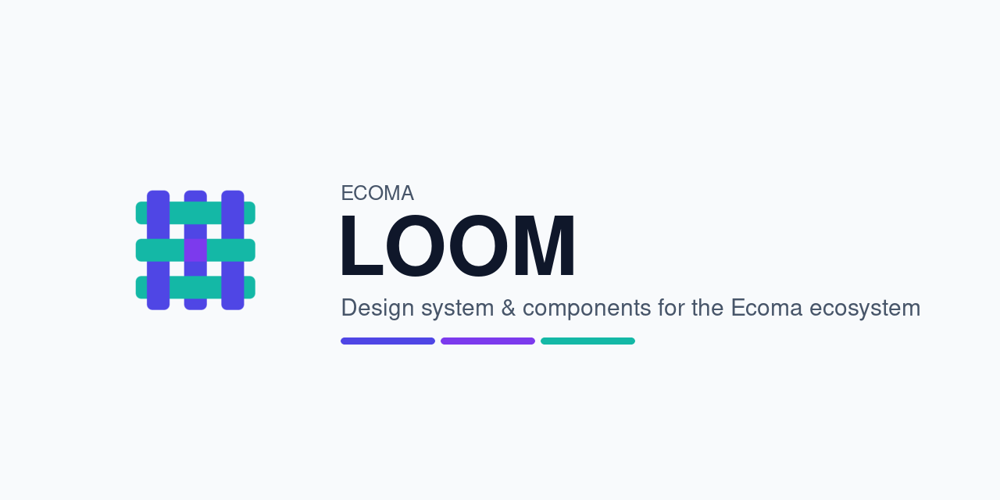
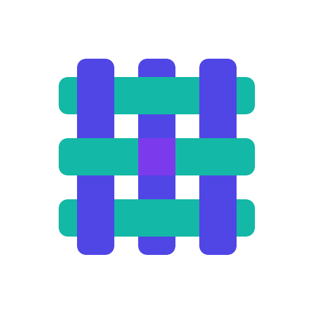

<p align="center">
  <a href="https://github.com/ecoma-io/loom/actions/workflows/ci.yml"></a>
  <a href="https://github.com/ecoma-io/loom/actions/workflows/analysis.yml"></a>
  <a href="https://scorecard.dev/viewer/?uri=github.com/ecoma-io/loom"></a>
  <a href="LICENSE"></a>
  = 24" />
  
  
  <a href="CONTRIBUTING.md"></a>
</p>

<p align="center">
  
</p>

<h1 align="center">Loom</h1>

<p align="center">
  <strong>Opinionated UI system &amp; composition library for cross-platform web applications.</strong><br />
  An open-source, accessibility-first component library and design-token system —
  Vue&nbsp;3, TypeScript and Tailwind&nbsp;CSS — from mobile to ultrawide.<br />
  <em>Build the interface once. Ship it everywhere. Never re-decide what a button is.</em>
</p>

<p align="center">
  <a href="https://loom.ecoma.io"><strong>Documentation&nbsp;→</strong></a>
</p>

---

## Every product rewrites its buttons. That is the tax Loom exists to stop paying.

A design system is not a folder of components. It is a decision, made once, that
every screen inherits — how far apart two things sit, how a dialog gives focus
back, what "destructive" looks like at 3am on a low-contrast monitor. Hand that
decision to each product and it is not made once. It is made again, slightly
differently, every sprint, by whoever is closest to the deadline.

**Loom is where that decision lives.** One vocabulary of design tokens, one set
of accessible UI primitives, one motion language — consumed by every surface,
owned by none of them. Open source under Apache-2.0, so you can take it into
your own product on the same terms.

## Built for cross-platform web applications

Loom is designed for applications that run everywhere the web does: browsers,
progressive web apps, Electron, and Tauri (desktop and mobile). A component
library for products that need desktop window chrome, responsive layouts that
stretch from phone to ultrawide, and an opinionated visual language that is
ready to ship — not a skeleton to assemble.

That premise demands more than a component dump. It demands:

- **Responsive composition**, not just responsive CSS — layout primitives that
  adapt to viewport and container, so a sidebar collapses at the right width
  and a master-detail panel stacks on mobile without the host writing a
  breakpoint.
- **Desktop awareness** — title bars, window controls, safe-area insets. A
  Tauri or Electron window has chrome a web page does not, and the components
  that live in it need to know that.
- **Content never stretches to infinity** — on an ultrawide monitor, readable
  content is bounded and the extra viewport goes to intentional whitespace,
  side panels, or supplementary content. Never to stretching.
- **Same design language on every viewport** — a button is the same button at
  320px and 3440px. The layout around it changes; the button does not.

Loom originated within the [Ecoma](https://ecoma.io) ecosystem and is developed
as an independent open-source UI system.

## What Loom gives you

|                              |                                                                                                                                                                         |
| ---------------------------- | ----------------------------------------------------------------------------------------------------------------------------------------------------------------------- |
| **Design tokens**            | Colour, spacing, radius, elevation, typography and motion — one source that light mode and dark mode both read from, so a rebrand is an edit rather than an audit.      |
| **UI primitives**            | The generic controls every product needs and no product should own: buttons, inputs, selects, dialogs, menus, toasts, tooltips, skeletons, switches, progress.          |
| **Composition primitives**   | Layout building blocks — Stack, Grid, Split, Center, Sidebar — that express spatial intent and adapt to viewport without the host writing breakpoint queries.           |
| **Blocks**                   | Compositions worth standardising once — empty states, page headers, title bars, sidebar navigation — assembled from primitives, never from scratch.                     |
| **Accessibility, built in**  | Keyboard paths, focus restoration, accessible names and reduced-motion behaviour ship inside the component. WCAG is the acceptance bar, not a checklist run afterwards. |
| **Theming that survives**    | Every visual decision is a token reference, so white-labelling a tenant is configuration rather than a fork.                                                            |
| **Typed and tree-shakeable** | Ships ES modules with TypeScript types. Consumers bundle what they import and nothing more.                                                                             |

## Who this is for

- **Teams building cross-platform web applications** — especially those
  targeting desktop (Electron, Tauri) alongside browser and mobile, where
  existing component libraries assume a web page, not an application window.
- **Design-system maintainers** — the token model, the artifact-per-primitive
  convention and the accessibility bar are all readable in the open, Apache-2.0,
  and free to borrow.
- **Anyone tired of re-deciding what a button is** — Loom is opinionated so
  you don't have to be. Ship the defaults, override the tokens that don't fit,
  and leave the rest alone.

## Getting started

Requirements: **Node ≥ 24** and **pnpm 11** (pinned in `package.json`, so
Corepack fetches the right one for you).

```bash
git clone https://github.com/ecoma-io/loom.git
cd loom
pnpm install
```

`pnpm install` also installs the Git hooks, so formatting, linting and commit
message checks run before anything reaches a branch.

```bash
pnpm lint        # ESLint
pnpm typecheck   # tsc --noEmit
pnpm test        # Vitest
pnpm e2e         # Playwright
pnpm format      # Prettier, in place
```

The component surface is landing in the open, one primitive at a time —
`packages/loom/src/index.ts` is always the complete export list. Follow along or ask for
something specific in [the issues](https://github.com/ecoma-io/loom/issues).

## Contributing

Loom holds what is **generic** — an affordance more than one product reaches for
the same way. That single rule decides most questions about what belongs here,
and [CONTRIBUTING.md](CONTRIBUTING.md) covers the rest: the commit format, the
tiers of tests, and what a reviewer will look for.

Everyone taking part is held to the [Code of Conduct](CODE_OF_CONDUCT.md).
Security issues go through [SECURITY.md](SECURITY.md) — never a public issue.

## Frequently asked

**Can I use Loom outside Ecoma?**
Yes. It is Apache-2.0, has no runtime dependency on any Ecoma platform, and is
designed to be consumed as an ordinary npm package.

**Why Apache-2.0 and not MIT?**
Apache-2.0 carries an explicit patent grant. For a component library that ends
up embedded in commercial products, that is the difference between "probably
fine" and "written down".

**Which framework does it target?**
Vue 3 with TypeScript, styled through Tailwind CSS. The design tokens themselves
are framework-neutral CSS custom properties, so they are usable anywhere.

**Does it support dark mode?**
Dark is derived from the same token set as light rather than maintained as a
second theme, which is why the two cannot drift apart. A `useTheme` composable
switches between light, dark, and system preference.

**How is accessibility verified?**
Keyboard operation, focus restoration and accessible naming are pinned by tests
and reviewed on every pull request — see the accessibility section of
[CONTRIBUTING.md](CONTRIBUTING.md).

**What about responsive layouts?**
Loom provides composition primitives (Stack, Grid, Split, Center, Sidebar) that
express layout intent and adapt to viewport width. Content is bounded at
readable widths on ultrawide screens — extra viewport goes to whitespace, not
stretching.

## License

[Apache License 2.0](LICENSE) © Ecoma.

Use it, ship it, fork it, sell what you build with it.

---

<p align="center">
  <br />
  <sub>
    An <a href="https://ecoma.io">Ecoma</a> open-source project ·
    <a href="https://loom.ecoma.io">Documentation</a> ·
    <a href="https://github.com/ecoma-io">Organisation</a> ·
    <a href="CONTRIBUTING.md">Contribute</a>
  </sub>
</p>
